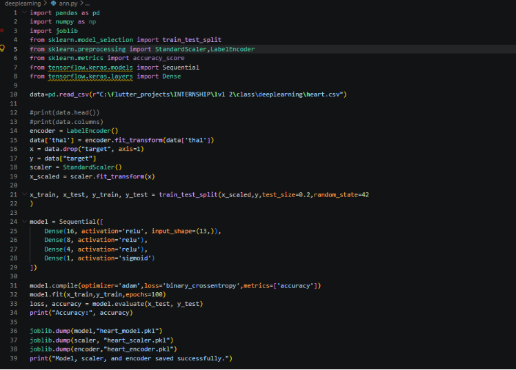
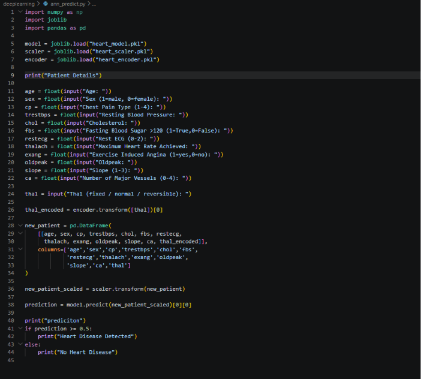
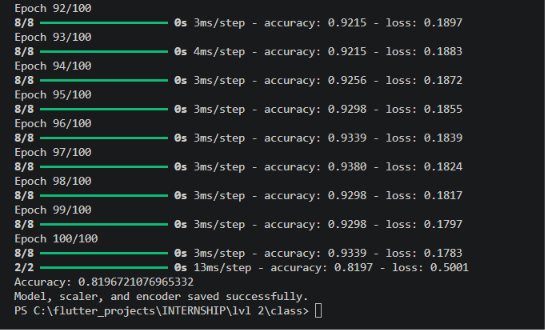
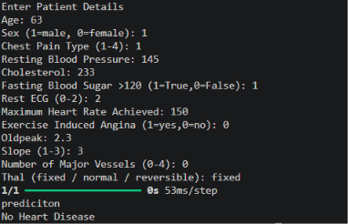
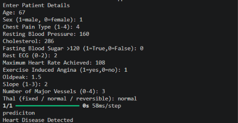

# ann_assignment
Level 2 ANN assignment by Mithra Nandhana B A

## Problem Statement
Develop a Machine Learning Regression model to predict a person’s medical insurance charges using the Insurance Dataset.

## Answer
The code is saved in the `ann_assignment/` along with the csv file and pkl files containing the data.

The code and the output are given below.

## *Code*
**program code**

**predict code**

## *Output*
**program output**

**predict output**

## Final Answer
*program output*
Accuracy: 0.8196721076965332
Model, scaler, and encoder saved successfully.

*predict output*
Enter Patient Details
Age: 63
Sex (1=male, 0=female): 1
Chest Pain Type (1-4): 1
Resting Blood Pressure: 145
Cholesterol: 233
Fasting Blood Sugar >120 (1=True,0=False): 1
Rest ECG (0-2): 2
Maximum Heart Rate Achieved: 150
Exercise Induced Angina (1=yes,0=no): 0
Oldpeak: 2.3
Slope (1-3): 3
Number of Major Vessels (0-4): 0
Thal (fixed / normal / reversible): fixed
1/1 ━━━━━━━━━━━━━━━━━━━━ 0s 53ms/step
prediciton
No Heart Disease

Enter Patient Details
Age: 67
Sex (1=male, 0=female): 1
Chest Pain Type (1-4): 4
Resting Blood Pressure: 160
Cholesterol: 286
Fasting Blood Sugar >120 (1=True,0=False): 0
Rest ECG (0-2): 2
Maximum Heart Rate Achieved: 108
Exercise Induced Angina (1=yes,0=no): 1
Oldpeak: 1.5
Slope (1-3): 2
Number of Major Vessels (0-4): 3
Thal (fixed / normal / reversible): normal
1/1 ━━━━━━━━━━━━━━━━━━━━ 0s 58ms/step
prediciton
Heart Disease Detected

# What I Learned
By this assignment and class, I learned:
1. ANN

:D
